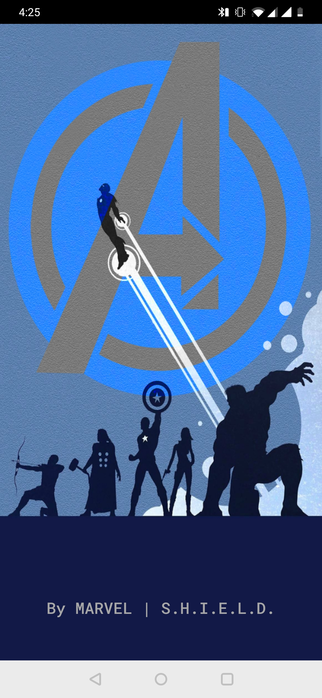
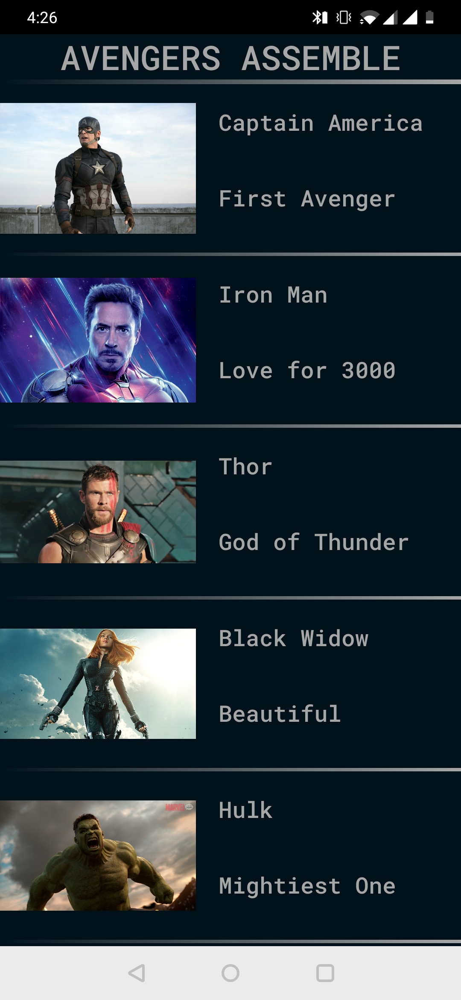
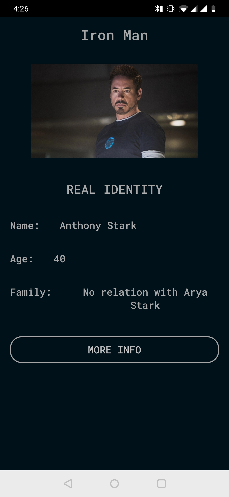
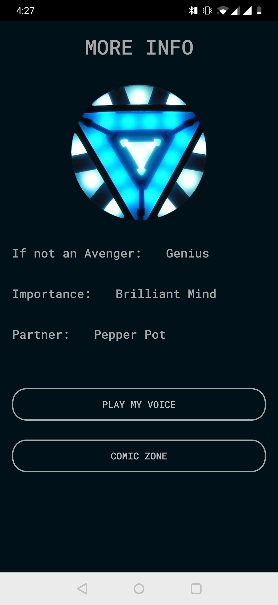

# Avengers Story

Android application created as a college assignment, to display funny 
information about my favourite Avengers.
Implemented:

-custom lists

-audio functionality

-WebViews

-Intent functionality

-Normal Layout functionalities and Buttons

1. Splash Screen

2. Custom List Screen

3. Basic Info Screen

3. More Info Screen

